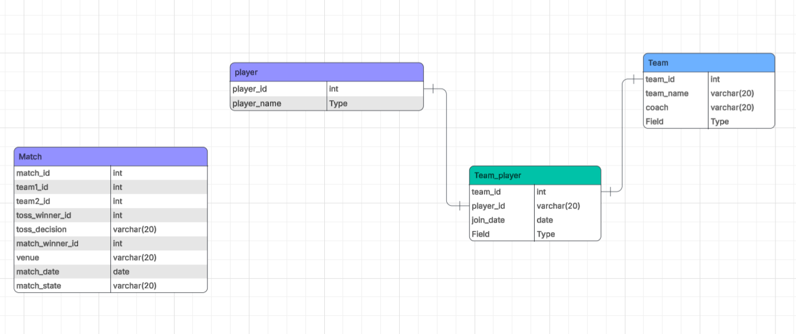
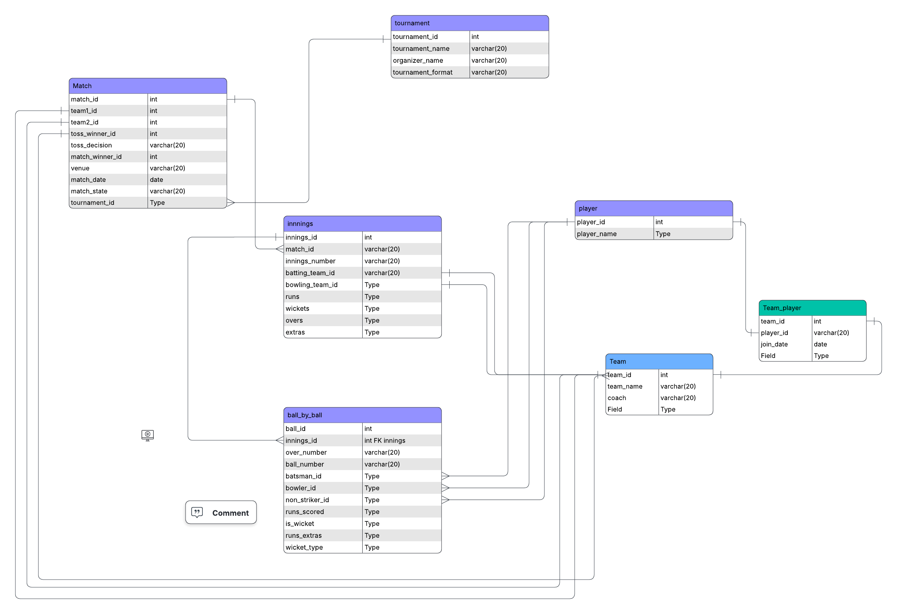
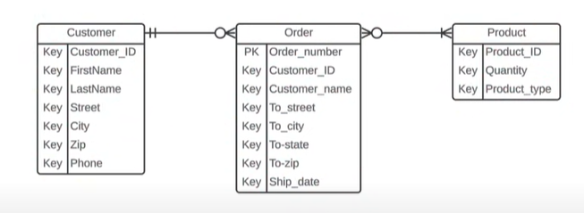
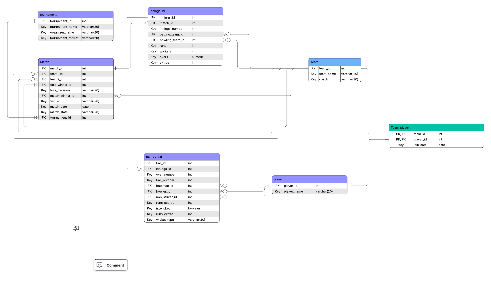

https://lucid.app/lucidchart/592d6fcb-1de0-423d-92fe-56eab091fb21/edit?beaconFlowId=7C7798A2A43EF685&invitationId=inv_2329f3db-9d7e-4dda-9de1-07fbe6b4b0b3&page=0_0#

**Players reference the Team**, *not* the other way around.

## What if many teams a player is part of?

That’s a **many-to-many (M:N)** relationship.

### Junction table or bridge table

team player can be a choice here rather than storing an array of past teams current teams

### Match (1) ─────< (∞) Innings

In SQL JOINs:
You use that FK to “attach” innings to their match:

SELECT *
FROM Match m
JOIN Innings i ON m.match_id = i.match_id
WHERE m.match_id = 12;

So even though the foreign key sits in Innings,
the relationship reads as “this innings belongs to match #12”.

