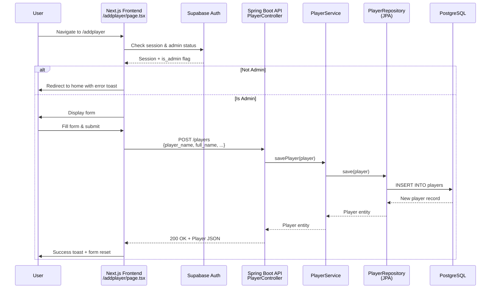
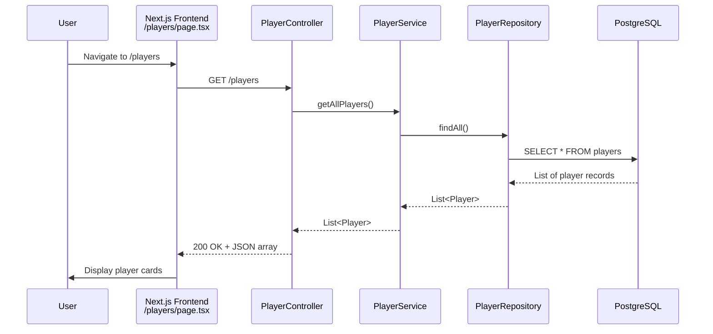
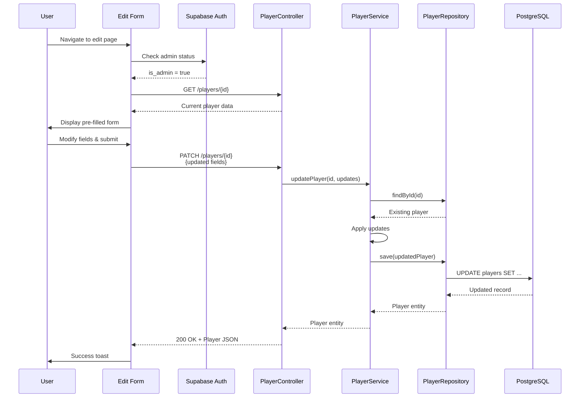
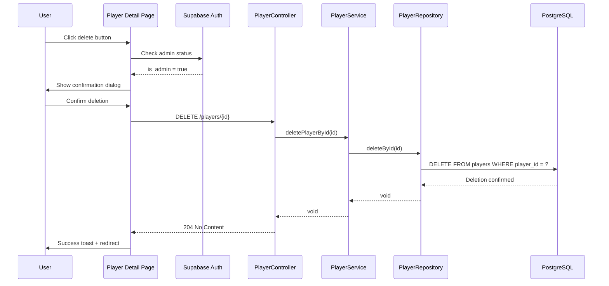

# CRUD Operations - Activity Diagrams

This document contains activity diagrams for all CRUD operations in the CricMate application, showing the flow of control from user interaction to database persistence.

---

## CREATE Operation - Activity Diagram

---

## READ Operation - Activity Diagram

---

## UPDATE Operation - Activity Diagram

---

## DELETE Operation - Activity Diagram

---

## Notes

- **Authentication**: All write operations (CREATE, UPDATE, DELETE) require admin authentication
- **Validation**: Client-side validation occurs before API calls
- **Error Handling**: Each operation includes error handling paths
- **User Feedback**: Toast notifications provide feedback for all operations
- **Database Constraints**: DELETE operation handles foreign key constraint violations

---

**Document Version**: 1.0  
**Last Updated**: December 3, 2025  
**Author**: CricMate Development Team
