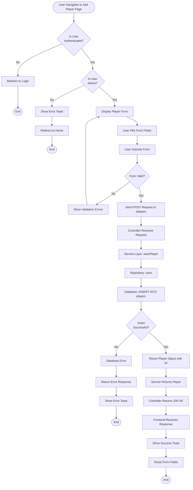
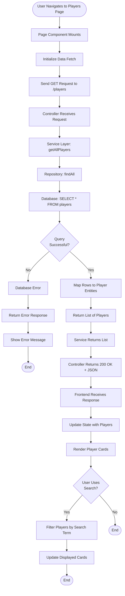

# CRUD Operations - Activity Diagrams

This document contains activity diagrams for all CRUD operations in the CricMate application, showing the flow of control from user interaction to database persistence.

---

## CREATE Operation - Activity Diagram



---

## READ Operation - Activity Diagram



---

## UPDATE Operation - Activity Diagram

```mermaid
flowchart TD
    Start([User Navigates to Edit Player Page]) --> CheckAuth{Is User<br/>Authenticated?}
    CheckAuth -->|No| RedirectLogin[Redirect to Login]
    RedirectLogin --> End1([End])
    
    CheckAuth -->|Yes| CheckAdmin{Is User<br/>Admin?}
    CheckAdmin -->|No| ShowError[Show Error Toast]
    ShowError --> RedirectHome[Redirect to Home]
    RedirectHome --> End2([End])
    
    CheckAdmin -->|Yes| FetchCurrent[Send GET /players/{id}]
    FetchCurrent --> ReceiveCurrent[Receive Current Player Data]
    ReceiveCurrent --> PreFillForm[Pre-fill Form with Current Data]
    PreFillForm --> DisplayForm[Display Editable Form]
    
    DisplayForm --> UserModifies[User Modifies Fields]
    UserModifies --> UserSubmits[User Submits Form]
    UserSubmits --> ValidateForm{Form Valid?}
    
    ValidateForm -->|No| ShowValidationError[Show Validation Errors]
    ShowValidationError --> DisplayForm
    
    ValidateForm -->|Yes| SendPATCH[Send PATCH Request to /players/{id}]
    SendPATCH --> ControllerReceives[Controller Receives Request]
    ControllerReceives --> ServiceUpdate[Service Layer: updatePlayer]
    ServiceUpdate --> RepoFindById[Repository: findById]
    
    RepoFindById --> PlayerExists{Player<br/>Found?}
    PlayerExists -->|No| NotFoundError[Return 404 Not Found]
    NotFoundError --> ShowNotFound[Show Error Toast]
    ShowNotFound --> End3([End])
    
    PlayerExists -->|Yes| ApplyUpdates[Apply Updates to Entity]
    ApplyUpdates --> RepoSave[Repository: save]
    RepoSave --> DBUpdate[Database: UPDATE players SET ...]
    
    DBUpdate --> DBSuccess{Update<br/>Successful?}
    DBSuccess -->|No| DBError[Database Error]
    DBError --> ReturnError[Return Error Response]
    ReturnError --> ShowErrorToast[Show Error Toast]
    ShowErrorToast --> End4([End])
    
    DBSuccess -->|Yes| ReturnUpdated[Return Updated Player]
    ReturnUpdated --> ServiceReturn[Service Returns Player]
    ServiceReturn --> ControllerReturn[Controller Returns 200 OK]
    ControllerReturn --> FrontendReceives[Frontend Receives Response]
    FrontendReceives --> ShowSuccess[Show Success Toast]
    ShowSuccess --> End5([End])
```

---

## DELETE Operation - Activity Diagram

```mermaid
flowchart TD
    Start([User Clicks Delete Button]) --> CheckAuth{Is User<br/>Authenticated?}
    CheckAuth -->|No| RedirectLogin[Redirect to Login]
    RedirectLogin --> End1([End])
    
    CheckAuth -->|Yes| CheckAdmin{Is User<br/>Admin?}
    CheckAdmin -->|No| ShowError[Show Error Toast]
    ShowError --> End2([End])
    
    CheckAdmin -->|Yes| ShowConfirm{User Confirms<br/>Deletion?}
    ShowConfirm -->|No| CancelDelete[Cancel Deletion]
    CancelDelete --> End3([End])
    
    ShowConfirm -->|Yes| SendDELETE[Send DELETE Request to /players/{id}]
    SendDELETE --> ControllerReceives[Controller Receives Request]
    ControllerReceives --> ServiceDelete[Service Layer: deletePlayerById]
    ServiceDelete --> RepoDelete[Repository: deleteById]
    RepoDelete --> DBDelete[Database: DELETE FROM players WHERE ...]
    
    DBDelete --> DBSuccess{Delete<br/>Successful?}
    DBSuccess -->|No| DBError[Database Error]
    DBError --> CheckConstraint{Foreign Key<br/>Constraint?}
    
    CheckConstraint -->|Yes| ShowConstraintError[Show Cannot Delete Message]
    ShowConstraintError --> End4([End])
    
    CheckConstraint -->|No| ShowGenericError[Show Error Toast]
    ShowGenericError --> End5([End])
    
    DBSuccess -->|Yes| ReturnVoid[Return 204 No Content]
    ReturnVoid --> ServiceReturn[Service Returns]
    ServiceReturn --> ControllerReturn[Controller Returns Success]
    ControllerReturn --> FrontendReceives[Frontend Receives Response]
    FrontendReceives --> ShowSuccess[Show Success Toast]
    ShowSuccess --> RedirectList[Redirect to Players List]
    RedirectList --> End6([End])
```

---

## Notes

- **Authentication**: All write operations (CREATE, UPDATE, DELETE) require admin authentication
- **Validation**: Client-side validation occurs before API calls
- **Error Handling**: Each operation includes error handling paths
- **User Feedback**: Toast notifications provide feedback for all operations
- **Database Constraints**: DELETE operation handles foreign key constraint violations

---

**Document Version**: 1.0  
**Last Updated**: December 3, 2025  
**Author**: CricMate Development Team
