# CRUD Operations - Collaboration Diagrams

This document contains collaboration diagrams for all CRUD operations in the CricMate application, showing the interactions between objects/components.

---

## CREATE Operation - Collaboration Diagram

```mermaid
graph TB
    User["👤 User"]
    Frontend["📱 Frontend<br/>(addplayer/page.tsx)"]
    Auth["🔐 Supabase Auth"]
    Controller["🎮 PlayerController"]
    Service["⚙️ PlayerService"]
    Repository["💾 PlayerRepository"]
    Database["🗄️ PostgreSQL"]
    
    User ---|"1: Navigate to /addplayer"| Frontend
    Frontend ---|"2: getSession()"| Auth
    Auth ---|"3: session + is_admin"| Frontend
    Frontend ---|"4: Display form"| User
    User ---|"5: Fill & submit"| Frontend
    Frontend ---|"6: POST /players"| Controller
    Controller ---|"7: savePlayer()"| Service
    Service ---|"8: save()"| Repository
    Repository ---|"9: INSERT"| Database
    Database ---|"10: player_id"| Repository
    Repository ---|"11: Player"| Service
    Service ---|"12: Player"| Controller
    Controller ---|"13: 200 OK"| Frontend
    Frontend ---|"14: Success toast"| User
    
    style User fill:#e1f5ff,stroke:#0066cc,stroke-width:2px
    style Frontend fill:#fff4e1,stroke:#ff9900,stroke-width:2px
    style Auth fill:#f0e1ff,stroke:#9933ff,stroke-width:2px
    style Controller fill:#ffe1e1,stroke:#ff3333,stroke-width:2px
    style Service fill:#e1ffe1,stroke:#33cc33,stroke-width:2px
    style Repository fill:#ffe1f5,stroke:#ff66cc,stroke-width:2px
    style Database fill:#e1e1e1,stroke:#666666,stroke-width:2px
```

### Object Interactions (CREATE)

1. **User → Frontend**: User navigates to add player page
2. **Frontend → Auth**: Check session and admin status
3. **Auth → Frontend**: Return session data with is_admin flag
4. **Frontend → User**: Display player form
5. **User → Frontend**: Fill form fields and submit
6. **Frontend → Controller**: POST request with player data
7. **Controller → Service**: Call savePlayer method
8. **Service → Repository**: Call JPA save method
9. **Repository → Database**: Execute INSERT statement
10. **Database → Repository**: Return generated player_id
11. **Repository → Service**: Return Player entity with ID
12. **Service → Controller**: Return Player entity
13. **Controller → Frontend**: HTTP 200 OK with Player JSON
14. **Frontend → User**: Show success toast and reset form

---

## READ Operation - Collaboration Diagram

```mermaid
graph TB
    User["👤 User"]
    Frontend["📱 Frontend<br/>(Players.tsx)"]
    Controller["🎮 PlayerController"]
    Service["⚙️ PlayerService"]
    Repository["💾 PlayerRepository"]
    Database["🗄️ PostgreSQL"]
    
    User ---|"1: Navigate to /players"| Frontend
    Frontend ---|"2: useEffect()"| Frontend
    Frontend ---|"3: GET /players"| Controller
    Controller ---|"4: getAllPlayers()"| Service
    Service ---|"5: findAll()"| Repository
    Repository ---|"6: SELECT *"| Database
    Database ---|"7: rows"| Repository
    Repository ---|"8: List<Player>"| Service
    Service ---|"9: List<Player>"| Controller
    Controller ---|"10: 200 OK"| Frontend
    Frontend ---|"11: setState()"| Frontend
    Frontend ---|"12: Display cards"| User
    
    style User fill:#e1f5ff,stroke:#0066cc,stroke-width:2px
    style Frontend fill:#fff4e1,stroke:#ff9900,stroke-width:2px
    style Controller fill:#ffe1e1,stroke:#ff3333,stroke-width:2px
    style Service fill:#e1ffe1,stroke:#33cc33,stroke-width:2px
    style Repository fill:#ffe1f5,stroke:#ff66cc,stroke-width:2px
    style Database fill:#e1e1e1,stroke:#666666,stroke-width:2px
```

### Object Interactions (READ)

1. **User → Frontend**: User navigates to players listing page
2. **Frontend → Frontend**: useEffect hook triggers on mount
3. **Frontend → Controller**: GET request to /players endpoint
4. **Controller → Service**: Call getAllPlayers method
5. **Service → Repository**: Call findAll method
6. **Repository → Database**: Execute SELECT query
7. **Database → Repository**: Return player rows
8. **Repository → Service**: Return List of Player entities
9. **Service → Controller**: Return List of Player entities
10. **Controller → Frontend**: HTTP 200 OK with JSON array
11. **Frontend → Frontend**: Update state with player data
12. **Frontend → User**: Render player cards in grid layout
13. **User → Frontend**: Optionally use search/filter
14. **Frontend → User**: Update displayed cards based on filter

---

## UPDATE Operation - Collaboration Diagram

```mermaid
graph TB
    User["👤 User"]
    Frontend["📱 Frontend<br/>(Edit Form)"]
    Auth["🔐 Supabase Auth"]
    Controller["🎮 PlayerController"]
    Service["⚙️ PlayerService"]
    Repository["💾 PlayerRepository"]
    Database["🗄️ PostgreSQL"]
    
    User ---|"1: Navigate to edit"| Frontend
    Frontend ---|"2: Check admin"| Auth
    Auth ---|"3: is_admin=true"| Frontend
    Frontend ---|"4: GET /{id}"| Controller
    Controller ---|"5: current data"| Frontend
    Frontend ---|"6: Pre-filled form"| User
    User ---|"7: Modify & submit"| Frontend
    Frontend ---|"8: PATCH /{id}"| Controller
    Controller ---|"9: updatePlayer()"| Service
    Service ---|"10: findById()"| Repository
    Repository ---|"11: SELECT"| Database
    Database ---|"12: record"| Repository
    Repository ---|"13: Player"| Service
    Service ---|"14: Apply updates"| Service
    Service ---|"15: save()"| Repository
    Repository ---|"16: UPDATE"| Database
    Database ---|"17: updated"| Repository
    Repository ---|"18: Player"| Service
    Service ---|"19: Player"| Controller
    Controller ---|"20: 200 OK"| Frontend
    Frontend ---|"21: Success"| User
    
    style User fill:#e1f5ff,stroke:#0066cc,stroke-width:2px
    style Frontend fill:#fff4e1,stroke:#ff9900,stroke-width:2px
    style Auth fill:#f0e1ff,stroke:#9933ff,stroke-width:2px
    style Controller fill:#ffe1e1,stroke:#ff3333,stroke-width:2px
    style Service fill:#e1ffe1,stroke:#33cc33,stroke-width:2px
    style Repository fill:#ffe1f5,stroke:#ff66cc,stroke-width:2px
    style Database fill:#e1e1e1,stroke:#666666,stroke-width:2px
```

### Object Interactions (UPDATE)

1. **User → Frontend**: User navigates to edit player page
2. **Frontend → Auth**: Check if user has admin privileges
3. **Auth → Frontend**: Return admin status confirmation
4. **Frontend → Controller**: GET request to fetch current player data
5. **Controller → Frontend**: Return current player data
6. **Frontend → User**: Display form pre-filled with current data
7. **User → Frontend**: Modify fields and submit form
8. **Frontend → Controller**: PATCH request with updated fields
9. **Controller → Service**: Call updatePlayer with ID and updates
10. **Service → Repository**: Find existing player by ID
11. **Repository → Database**: Execute SELECT query
12. **Database → Repository**: Return player record
13. **Repository → Service**: Return Player entity
14. **Service → Service**: Apply updates to entity fields
15. **Service → Repository**: Save updated entity
16. **Repository → Database**: Execute UPDATE statement
17. **Database → Repository**: Return updated record
18. **Repository → Service**: Return updated Player entity
19. **Service → Controller**: Return updated Player entity
20. **Controller → Frontend**: HTTP 200 OK with updated Player JSON
21. **Frontend → User**: Show success toast notification

---

## DELETE Operation - Collaboration Diagram

```mermaid
graph TB
    User["👤 User"]
    Frontend["📱 Frontend<br/>(Player Detail)"]
    Auth["🔐 Supabase Auth"]
    Controller["🎮 PlayerController"]
    Service["⚙️ PlayerService"]
    Repository["💾 PlayerRepository"]
    Database["🗄️ PostgreSQL"]
    
    User ---|"1: Click delete"| Frontend
    Frontend ---|"2: Check admin"| Auth
    Auth ---|"3: is_admin=true"| Frontend
    Frontend ---|"4: Confirm dialog"| User
    User ---|"5: Confirm"| Frontend
    Frontend ---|"6: DELETE /{id}"| Controller
    Controller ---|"7: deleteById()"| Service
    Service ---|"8: deleteById()"| Repository
    Repository ---|"9: DELETE"| Database
    Database ---|"10: Confirmed"| Repository
    Repository ---|"11: void"| Service
    Service ---|"12: void"| Controller
    Controller ---|"13: 204"| Frontend
    Frontend ---|"14: Success"| User
    Frontend ---|"15: Redirect"| User
    
    style User fill:#e1f5ff,stroke:#0066cc,stroke-width:2px
    style Frontend fill:#fff4e1,stroke:#ff9900,stroke-width:2px
    style Auth fill:#f0e1ff,stroke:#9933ff,stroke-width:2px
    style Controller fill:#ffe1e1,stroke:#ff3333,stroke-width:2px
    style Service fill:#e1ffe1,stroke:#33cc33,stroke-width:2px
    style Repository fill:#ffe1f5,stroke:#ff66cc,stroke-width:2px
    style Database fill:#e1e1e1,stroke:#666666,stroke-width:2px
```

### Object Interactions (DELETE)

1. **User → Frontend**: User clicks delete button on player detail page
2. **Frontend → Auth**: Verify user has admin privileges
3. **Auth → Frontend**: Return admin status confirmation
4. **Frontend → User**: Display confirmation dialog
5. **User → Frontend**: Confirm deletion action
6. **Frontend → Controller**: DELETE request with player ID
7. **Controller → Service**: Call deletePlayerById method
8. **Service → Repository**: Call deleteById method
9. **Repository → Database**: Execute DELETE statement
10. **Database → Repository**: Confirm deletion success
11. **Repository → Service**: Return void (no content)
12. **Service → Controller**: Return void
13. **Controller → Frontend**: HTTP 204 No Content response
14. **Frontend → User**: Show success toast notification
15. **Frontend → User**: Redirect to players listing page

---

## Component Responsibilities

### Frontend Components
- **User Interface**: Display forms, cards, and interactive elements
- **Authentication**: Check session and admin status via Supabase Auth
- **Validation**: Client-side form validation before API calls
- **State Management**: Manage component state with React hooks
- **User Feedback**: Display toast notifications and loading states

### PlayerController
- **Request Handling**: Receive and parse HTTP requests
- **Routing**: Map endpoints to appropriate service methods
- **Response Formatting**: Return HTTP responses with proper status codes
- **Delegation**: Delegate business logic to service layer

### PlayerService
- **Business Logic**: Encapsulate domain-specific operations
- **Orchestration**: Coordinate between controller and repository
- **Validation**: Apply business rules and constraints
- **Transformation**: Transform data between layers if needed

### PlayerRepository
- **Data Access**: Interface with database via JPA
- **Query Execution**: Execute SQL queries (auto-generated by JPA)
- **Entity Mapping**: Map database rows to Java entities
- **Transaction Management**: Handle database transactions

### PostgreSQL Database
- **Data Persistence**: Store player records permanently
- **Constraint Enforcement**: Enforce primary keys, foreign keys, and constraints
- **Query Processing**: Execute SQL statements efficiently
- **Transaction Support**: Provide ACID guarantees

---

## Key Patterns

### 1. **Layered Architecture**
All operations follow a clear separation of concerns across layers:
- **Presentation Layer**: Frontend (Next.js/React)
- **API Layer**: Controller (Spring Boot)
- **Business Logic Layer**: Service
- **Data Access Layer**: Repository (JPA)
- **Persistence Layer**: Database (PostgreSQL)

### 2. **Request-Response Flow**
- Frontend initiates requests
- Each layer delegates to the next
- Responses flow back through the same layers
- Frontend provides user feedback

### 3. **Authentication & Authorization**
- Supabase Auth manages user sessions
- Admin status checked for write operations
- Public read access for listing and detail views

### 4. **Error Handling**
- Each layer can return errors
- Errors propagate back to frontend
- User-friendly error messages displayed via toasts

---

**Document Version**: 1.0  
**Last Updated**: December 3, 2025  
**Author**: CricMate Development Team
