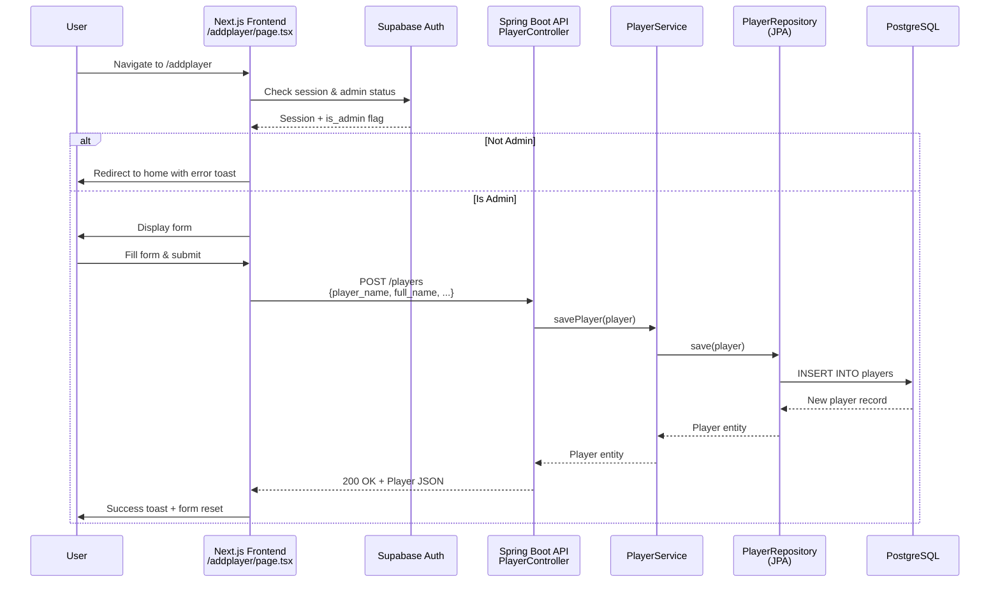
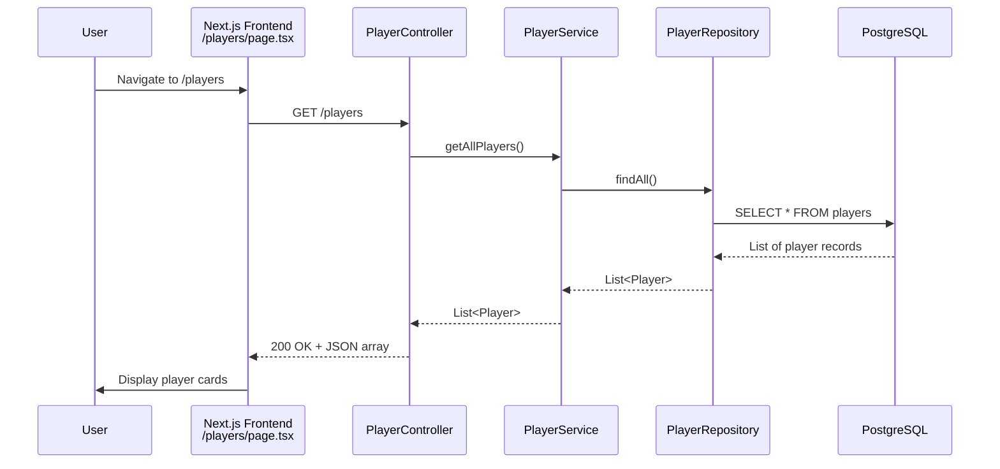
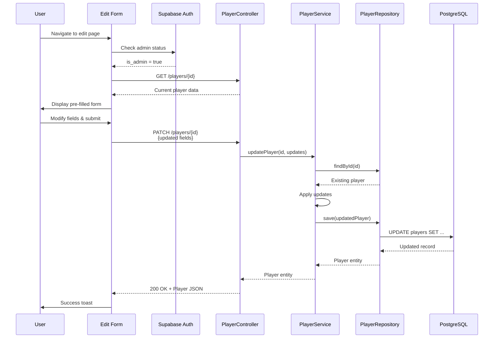
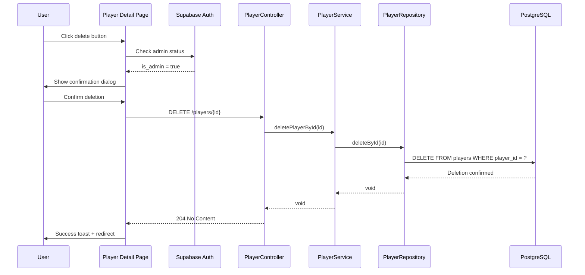

# CRUD Operations Flow Documentation - Player Entity

This document traces the complete flow of CRUD operations from frontend to backend for the **Player** entity in CricMate. Since most CRUD operations follow identical patterns, this serves as the reference implementation with side notes for variations in other entities.

---

## 🎯 Overview

**Base URL**: `http://localhost:8080`  
**Frontend Framework**: Next.js 16 with TypeScript  
**Backend Framework**: Spring Boot 3.3.4  
**Database**: PostgreSQL (via Supabase)  
**Authentication**: Supabase Auth (Admin-only for Create/Update/Delete)

---

## 📖 CREATE Operation

### Flow: Adding a New Player



#### Step-by-Step Flow

**Step 1: Authentication Check (Frontend)**
- **File**: `nextfront/src/app/addplayer/page.tsx`
- **Action**: On page load, check if user is logged in and has admin privileges
- **Code**:
  ```typescript
  const { data: { session } } = await supabase.auth.getSession();
  const { data: profiles } = await supabase
    .from("profiles")
    .select("is_admin")
    .eq("id", session.user.id)
    .single();
  ```
- **Outcome**: If not admin, redirect to home; otherwise, show form

> **📝 Side Note - Other Entities:**  
> - **Team** (`/addteam`): Same auth pattern  
> - **Match** (`/addmatch`): Same auth pattern  
> - **Tournament** (`/addtournament`): Same auth pattern  
> - All admin routes use identical authentication flow

---

**Step 2: Form Input Collection (Frontend)**
- **File**: `nextfront/src/app/addplayer/page.tsx`
- **Action**: User fills in player details (name, DOB, batting/bowling style, teams)
- **State Management**:
  ```typescript
  const [playerName, setPlayerName] = useState("");
  const [fullName, setFullName] = useState("");
  const [dob, setDob] = useState("");
  const [battingStyle, setBattingStyle] = useState("");
  const [bowlingStyle, setBowlingStyle] = useState("");
  const [playingRole, setPlayingRole] = useState("");
  const [selectedTeamIds, setSelectedTeamIds] = useState<number[]>([]);
  ```
- **Validation**: Required fields are `player_name` and `full_name`

> **📝 Side Note - Other Entities:**  
> - **Team**: Only requires `team_name` (simpler form)  
> - **Match**: Requires `team_a_id`, `team_b_id`, `tournament_id`, `match_date`, `venue`, `match_format`  
> - **Tournament**: Requires `tournament_name`, `start_date`, `end_date`  
> - Each entity has different required fields based on database schema

---

**Step 3: HTTP POST Request (Frontend → Backend)**
- **File**: `nextfront/src/app/addplayer/page.tsx`
- **Endpoint**: `POST http://localhost:8080/players`
- **Request Body**:
  ```json
  {
    "player_name": "Virat",
    "full_name": "Virat Kohli",
    "date_of_birth": "1988-11-05",
    "batting_style": "Right hand Bat",
    "bowling_style": "Medium",
    "playing_role": "Top order Batter",
    "teams": [
      { "team_id": 1 },
      { "team_id": 3 }
    ]
  }
  ```
- **Headers**: `Content-Type: application/json`

> **📝 Side Note - Other Entities:**  
> - **Team**: `POST /teams/create` with `{ "team_name": "RCB" }`  
> - **Match**: `POST /matches` with team IDs, tournament ID, date, venue, format  
> - **Tournament**: `POST /tournaments` with name and dates  
> - **Ball**: `POST /balls` with innings_id, over, ball number, batsman, bowler, runs, wicket

---

**Step 4: Controller Layer (Backend)**
- **File**: `backend/src/main/java/com/cricmate/backend/controller/PlayerController.java`
- **Method**: `addPlayer(@RequestBody Player player)`
- **Annotation**: `@PostMapping`
- **Action**: Receives JSON, deserializes to `Player` entity, delegates to service
- **Code**:
  ```java
  @PostMapping
  public Player addPlayer(@RequestBody Player player) {
      return playerService.savePlayer(player);
  }
  ```

> **📝 Side Note - Other Entities:**  
> - **Team**: `TeamController.addTeam()` uses `@PostMapping("/create")` (custom endpoint)  
> - **Match**: `MatchController.createMatch()` uses `@PostMapping` (same pattern)  
> - **Tournament**: `TournamentController` follows same pattern  
> - **Ball**: `BallController` follows same pattern  
> - All controllers follow the same delegation pattern to their respective services

---

**Step 5: Service Layer (Backend)**
- **File**: `backend/src/main/java/com/cricmate/backend/services/PlayerService.java`
- **Method**: `savePlayer(Player player)`
- **Action**: Business logic layer (minimal in this case), delegates to repository
- **Code**:
  ```java
  public Player savePlayer(Player player) {
      return playerRepository.save(player);
  }
  ```
- **Purpose**: Encapsulates business logic, can add validation/transformation here

> **📝 Side Note - Other Entities:**  
> - **Team**: `TeamService.saveTeam()` - identical pattern  
> - **Match**: `MatchService.saveMatch()` - may include additional validation  
> - **Tournament**: `TournamentService` - identical pattern  
> - **Ball**: `BallService` - may calculate derived stats before saving  
> - Service layer is where entity-specific business logic differs

---

**Step 6: Repository Layer (Backend)**
- **File**: `backend/src/main/java/com/cricmate/backend/repository/PlayerRepository.java`
- **Interface**: Extends `JpaRepository<Player, Integer>`
- **Method**: `save(Player player)` (inherited from JpaRepository)
- **Action**: JPA translates to SQL INSERT statement
- **SQL Generated**:
  ```sql
  INSERT INTO players (player_name, full_name, date_of_birth, batting_style, bowling_style, playing_role)
  VALUES ('Virat', 'Virat Kohli', '1988-11-05', 'Right hand Bat', 'Medium', 'Top order Batter')
  RETURNING player_id;
  ```

> **📝 Side Note - Other Entities:**  
> - **Team**: `TeamRepository extends JpaRepository<Team, Integer>`  
> - **Match**: `MatchRepository extends JpaRepository<Match, Integer>`  
> - **Tournament**: `TournamentRepository extends JpaRepository<Tournament, Integer>`  
> - **Ball**: `BallRepository extends JpaRepository<Ball, Integer>` + custom query methods  
> - All repositories extend JpaRepository, providing standard CRUD methods

---

**Step 7: Database Persistence & Response**
- **Database**: PostgreSQL executes INSERT and returns generated `player_id`
- **Response Flow**: DB → Repository → Service → Controller → Frontend
- **Response JSON**:
  ```json
  {
    "player_id": 42,
    "player_name": "Virat",
    "full_name": "Virat Kohli",
    "date_of_birth": "1988-11-05",
    "batting_style": "Right hand Bat",
    "bowling_style": "Medium",
    "playing_role": "Top order Batter",
    "age": "36y 0m 28d"
  }
  ```
- **Frontend**: Displays success toast, resets form

> **📝 Side Note - Other Entities:**  
> - **Team**: Returns `team_id` and `team_name`  
> - **Match**: Returns full match object with `match_id`  
> - **Tournament**: Returns `tournament_id` and tournament details  
> - **Ball**: Returns `ball_id` and all ball details  
> - Response structure matches the entity model

---

## 📚 READ Operation

### Flow: Fetching Player(s)



#### Step-by-Step Flow

**Step 1: Page Load (Frontend)**
- **File**: `nextfront/src/components/Players.tsx`
- **Action**: Component mounts, triggers data fetch
- **Code**:
  ```typescript
  useEffect(() => {
    async function fetchPlayers() {
      const res = await fetch("http://localhost:8080/players");
      const data = await res.json();
      setPlayers(data);
    }
    fetchPlayers();
  }, []);
  ```

> **📝 Side Note - Other Entities:**  
> - **Team**: `GET /teams` from `/teams/page.tsx`  
> - **Match**: `GET /matches` from `/matches/page.tsx`  
> - **Tournament**: `GET /tournaments` from `/tournaments/page.tsx`  
> - All listing pages follow identical fetch pattern

---

**Step 2: HTTP GET Request (Frontend → Backend)**
- **Endpoint**: `GET http://localhost:8080/players`
- **No Request Body**: GET requests don't have bodies
- **No Authentication Required**: Public endpoint

> **📝 Side Note - Other Entities:**  
> - **Team**: `GET /teams`  
> - **Match**: `GET /matches`  
> - **Tournament**: `GET /tournaments`  
> - **Single Entity**: `GET /players/{id}`, `GET /teams/{id}`, etc.  
> - **Full Details**: `GET /players/full/{id}` (includes related entities like teams)

---

**Step 3: Controller Layer (Backend)**
- **File**: `PlayerController.java`
- **Method**: `getAllPlayers()`
- **Annotation**: `@GetMapping`
- **Code**:
  ```java
  @GetMapping
  public List<Player> getAllPlayers() {
      return playerService.getAllPlayers();
  }
  ```

> **📝 Side Note - Other Entities:**  
> - **Team**: `TeamController.getAllTeams()` - identical pattern  
> - **Match**: `MatchController.getAllMatches()` - identical pattern  
> - **Single Entity**: `@GetMapping("/{id}")` with `@PathVariable int id`  
> - **Full Details**: `@GetMapping("/full/{id}")` returns DTO with related entities

---

**Step 4: Service Layer (Backend)**
- **File**: `PlayerService.java`
- **Method**: `getAllPlayers()`
- **Code**:
  ```java
  public List<Player> getAllPlayers() {
      return playerRepository.findAll();
  }
  ```

> **📝 Side Note - Other Entities:**  
> - **Team**: `TeamService.getAllTeams()` - identical  
> - **Match**: `MatchService.getAllMatches()` - identical  
> - **Single Entity**: `getPlayerById(id)` uses `findById(id).orElseThrow()`  
> - **Custom Queries**: Ball and Match services may have custom finder methods

---

**Step 5: Repository Query (Backend)**
- **File**: `PlayerRepository.java`
- **Method**: `findAll()` (inherited from JpaRepository)
- **SQL Generated**:
  ```sql
  SELECT player_id, player_name, full_name, date_of_birth, 
         batting_style, bowling_style, playing_role
  FROM players;
  ```

> **📝 Side Note - Other Entities:**  
> - **Team**: `SELECT team_id, team_name FROM teams`  
> - **Match**: Joins with teams and tournament tables for full data  
> - **Ball**: May use custom queries like `findByInningsId()`  
> - **Custom Queries**: Some repositories have `@Query` annotations for complex joins

---

**Step 6: Database Query Execution**
- **Database**: PostgreSQL executes SELECT and returns rows
- **JPA Mapping**: Rows mapped to `Player` entity objects
- **Response**: List of Player objects serialized to JSON

> **📝 Side Note - Other Entities:**  
> - All entities follow same JPA mapping pattern  
> - Complex entities (Match, Ball) may have nested objects  
> - DTOs used for responses with related entities (e.g., `FullPlayerDTO` includes teams)

---

**Step 7: Frontend Rendering**
- **File**: `Players.tsx`
- **Action**: Map over players array, render cards
- **Features**: Search filtering, responsive grid layout
- **Code**:
  ```typescript
  {filteredPlayers.map((player) => (
    <Link key={player.player_id} href={`/player/${player.player_id}`}>
      <div className="player-card">
        {player.player_name}
      </div>
    </Link>
  ))}
  ```

> **📝 Side Note - Other Entities:**  
> - **Team**: Similar card layout with team names  
> - **Match**: Shows team names, date, venue, format  
> - **Tournament**: Shows tournament name and date range  
> - All listing pages have search functionality

---

## ✏️ UPDATE Operation

### Flow: Updating a Player

> **⚠️ Note**: Full update functionality is not implemented in the current codebase for Player. This documents the expected flow based on the architecture pattern used for other entities (e.g., Match uses PATCH).



#### Step-by-Step Flow

**Step 1: Authentication & Load Current Data (Frontend)**
- **Expected File**: `nextfront/src/app/player/[id]/edit/page.tsx` (not yet implemented)
- **Action**: Check admin status, fetch current player data
- **Code Pattern**:
  ```typescript
  // Auth check (same as create)
  const { data: { session } } = await supabase.auth.getSession();
  
  // Fetch current data
  const res = await fetch(`http://localhost:8080/players/${id}`);
  const player = await res.json();
  setPlayerName(player.player_name);
  setFullName(player.full_name);
  // ... populate other fields
  ```

> **📝 Side Note - Other Entities:**  
> - **Match**: Has PATCH endpoint implemented (`MatchController.patchMatch()`)  
> - **Ball**: Has PATCH endpoint for editing commentary (`BallController.patchBall()`)  
> - **Team/Tournament**: Update not yet implemented  
> - Pattern: Fetch existing data → pre-fill form → allow edits

---

**Step 2: User Modifies Fields (Frontend)**
- **Action**: User changes one or more fields in the form
- **State**: Only modified fields need to be sent (partial update)
- **Example**: User changes `batting_style` from "Right hand Bat" to "Left hand Bat"

> **📝 Side Note - Other Entities:**  
> - **Match**: Can update `match_state`, `winner_team_id`, etc.  
> - **Ball**: Can update `runs`, `wicket`, `extras`, `commentary`  
> - PATCH allows partial updates (only send changed fields)

---

**Step 3: HTTP PATCH Request (Frontend → Backend)**
- **Expected Endpoint**: `PATCH http://localhost:8080/players/{id}`
- **Request Body** (only changed fields):
  ```json
  {
    "batting_style": "Left hand Bat"
  }
  ```
- **Alternative**: PUT for full replacement (less common)

> **📝 Side Note - Other Entities:**  
> - **Match**: `PATCH /matches/{id}` with `MatchUpdateDTO`  
> - **Ball**: `PATCH /balls/{id}` with `BallUpdateDTO`  
> - DTOs define which fields are updatable

---

**Step 4: Controller Layer (Backend)**
- **Expected File**: `PlayerController.java`
- **Expected Method**:
  ```java
  @PatchMapping("/{id}")
  public Player updatePlayer(@PathVariable int id, 
                            @RequestBody PlayerUpdateDTO updates) {
      return playerService.updatePlayer(id, updates);
  }
  ```

> **📝 Side Note - Other Entities:**  
> - **Match**: `MatchController.patchMatch()` implemented  
> - **Ball**: `BallController.patchBall()` implemented  
> - Uses DTO to accept partial updates

---

**Step 5: Service Layer (Backend)**
- **Expected File**: `PlayerService.java`
- **Expected Method**:
  ```java
  public Player updatePlayer(Integer id, PlayerUpdateDTO updates) {
      Player player = playerRepository.findById(id)
          .orElseThrow(() -> new RuntimeException("Player not found"));
      
      // Apply updates
      if (updates.getPlayerName() != null) 
          player.setPlayer_name(updates.getPlayerName());
      if (updates.getBattingStyle() != null) 
          player.setBatting_style(updates.getBattingStyle());
      // ... other fields
      
      return playerRepository.save(player);
  }
  ```

> **📝 Side Note - Other Entities:**  
> - **Match**: `MatchService.updateMatch()` follows this pattern  
> - **Ball**: `BallService.updateBall()` follows this pattern  
> - Pattern: Fetch → Modify → Save

---

**Step 6: Repository Update (Backend)**
- **Method**: `save(player)` (JPA detects existing entity and updates)
- **SQL Generated**:
  ```sql
  UPDATE players 
  SET batting_style = 'Left hand Bat'
  WHERE player_id = 42;
  ```

> **📝 Side Note - Other Entities:**  
> - Same pattern for all entities  
> - JPA automatically generates UPDATE SQL  
> - Only modified fields are updated in the SQL

---

**Step 7: Response & UI Update**
- **Response**: Updated player object
- **Frontend**: Show success toast, optionally redirect to player detail page

> **📝 Side Note - Other Entities:**  
> - **Match**: Redirects to match detail page  
> - **Ball**: Updates commentary in real-time  
> - Consistent success feedback pattern

---

## 🗑️ DELETE Operation

### Flow: Deleting a Player



#### Step-by-Step Flow

**Step 1: Admin Check & Confirmation (Frontend)**
- **Expected File**: Player detail page with delete button
- **Action**: Verify admin status, show confirmation dialog
- **Code Pattern**:
  ```typescript
  const { isAdmin } = useIsAdmin();
  
  const handleDelete = async () => {
    if (!confirm("Are you sure you want to delete this player?")) return;
    // Proceed with deletion
  };
  ```

> **📝 Side Note - Other Entities:**  
> - **Team**: `TeamController.deletePlayer()` (method name is misleading, should be deleteTeam)  
> - **Match**: Delete not implemented (matches are historical records)  
> - **Ball**: Delete not implemented (use update to correct errors)  
> - Deletion should be used carefully for entities with relationships

---

**Step 2: HTTP DELETE Request (Frontend → Backend)**
- **Endpoint**: `DELETE http://localhost:8080/players/{id}`
- **No Request Body**: DELETE requests typically don't have bodies
- **Example**: `DELETE http://localhost:8080/players/42`

> **📝 Side Note - Other Entities:**  
> - **Team**: `DELETE /teams/{id}`  
> - Pattern is identical across entities  
> - ID passed as path variable

---

**Step 3: Controller Layer (Backend)**
- **File**: `PlayerController.java`
- **Method**: `deletePlayer(@PathVariable int id)`
- **Annotation**: `@DeleteMapping("/{id}")`
- **Code**:
  ```java
  @DeleteMapping("/{id}")
  public void deletePlayer(@PathVariable int id) {
      playerService.deletePlayerById(id);
  }
  ```

> **📝 Side Note - Other Entities:**  
> - **Team**: `TeamController.deletePlayer()` - identical pattern  
> - Returns void (or ResponseEntity for more control)

---

**Step 4: Service Layer (Backend)**
- **File**: `PlayerService.java`
- **Method**: `deletePlayerById(Integer id)`
- **Code**:
  ```java
  public void deletePlayerById(Integer id) {
      playerRepository.deleteById(id);
  }
  ```
- **Note**: Could add existence check before deletion

> **📝 Side Note - Other Entities:**  
> - **Team**: `TeamService.deleteTeamById()` - identical  
> - May include cascade deletion logic for related entities  
> - Could throw exception if entity has dependencies

---

**Step 5: Repository Deletion (Backend)**
- **Method**: `deleteById(id)` (inherited from JpaRepository)
- **SQL Generated**:
  ```sql
  DELETE FROM players WHERE player_id = 42;
  ```
- **Cascade**: May trigger cascade deletes on related tables (e.g., team_player junction table)

> **📝 Side Note - Other Entities:**  
> - **Team**: May need to handle team_player relationships  
> - **Match**: Would need to handle innings, balls (if deletion were implemented)  
> - Database constraints determine cascade behavior

---

**Step 6: Response & Redirect**
- **Response**: 204 No Content (or 200 OK with void)
- **Frontend**: Show success toast, redirect to players list
- **Code**:
  ```typescript
  toast.success("Player deleted successfully");
  router.push("/players");
  ```

> **📝 Side Note - Other Entities:**  
> - **Team**: Redirect to `/teams`  
> - Consistent redirect pattern to entity list page

---

## 🔑 Key Differences Across Entities

### Player vs Team
- **Complexity**: Player has more fields (DOB, styles, role)
- **Relationships**: Player has many-to-many with Team
- **Endpoint**: Team uses `/teams/create` instead of `/teams` for POST

### Player vs Match
- **Relationships**: Match has foreign keys to teams and tournament
- **Update**: Match has PATCH implemented for updating match state/winner
- **Complexity**: Match involves more complex queries (joining teams, tournaments)

### Player vs Ball
- **Update Frequency**: Balls are frequently updated (commentary edits)
- **Custom Queries**: Ball repository has many custom query methods
- **Calculations**: Ball service includes stat calculations

### Player vs Tournament
- **Simplicity**: Tournament is simpler (just name and dates)
- **Relationships**: Tournament has one-to-many with Match

---

## 📊 Summary Table

| Operation | HTTP Method | Endpoint | Auth Required | Frontend File | Backend Controller | Backend Service |
|-----------|-------------|----------|---------------|---------------|-------------------|-----------------|
| **Create** | POST | `/players` | ✅ Admin | `addplayer/page.tsx` | `PlayerController.addPlayer()` | `PlayerService.savePlayer()` |
| **Read All** | GET | `/players` | ❌ Public | `Players.tsx` | `PlayerController.getAllPlayers()` | `PlayerService.getAllPlayers()` |
| **Read One** | GET | `/players/{id}` | ❌ Public | `player/[id]/page.tsx` | `PlayerController.getPlayer()` | `PlayerService.getPlayerById()` |
| **Read Full** | GET | `/players/full/{id}` | ❌ Public | Player detail page | `PlayerController.getFullPlayer()` | `PlayerService.getFullPlayerById()` |
| **Update** | PATCH | `/players/{id}` | ✅ Admin | *Not implemented* | *Not implemented* | *Not implemented* |
| **Delete** | DELETE | `/players/{id}` | ✅ Admin | *Not implemented* | `PlayerController.deletePlayer()` | `PlayerService.deletePlayerById()` |

---

## 🎯 Common Patterns

### 1. **Layered Architecture**
All CRUD operations follow: `Frontend → Controller → Service → Repository → Database`

### 2. **JPA Repository**
All entities use `JpaRepository<Entity, Integer>` for standard CRUD methods

### 3. **RESTful Endpoints**
- `GET /entity` - List all
- `GET /entity/{id}` - Get one
- `POST /entity` - Create
- `PATCH /entity/{id}` - Update
- `DELETE /entity/{id}` - Delete

### 4. **Authentication Pattern**
```typescript
// Check session
const { data: { session } } = await supabase.auth.getSession();

// Check admin status
const { data: profiles } = await supabase
  .from("profiles")
  .select("is_admin")
  .eq("id", session.user.id)
  .single();

// Redirect if not admin
if (!profiles?.is_admin) {
  router.push("/");
}
```

### 5. **Error Handling**
- Frontend: Try-catch with error toast
- Backend: `orElseThrow(() -> new RuntimeException("Entity not found"))`

---

## 🚀 Best Practices Observed

1. **Separation of Concerns**: Clear separation between layers
2. **DTO Usage**: DTOs for complex responses (e.g., `FullPlayerDTO`)
3. **Admin Protection**: All create/update/delete operations require admin auth
4. **User Feedback**: Toast notifications for all operations
5. **Form Validation**: Client-side validation before API calls
6. **Responsive Design**: All pages mobile-friendly
7. **Loading States**: Loading indicators during async operations

---

## 📝 Notes for Developers

- **Adding New Entity**: Follow the Player pattern - create Model, Repository, Service, Controller, and frontend pages
- **Custom Queries**: Add to Repository interface with `@Query` annotation
- **DTOs**: Create DTOs for complex responses or partial updates
- **Authentication**: Always check admin status for write operations
- **Testing**: Test each layer independently (unit tests for service, integration tests for controller)

---

**Document Version**: 1.0  
**Last Updated**: December 3, 2025  
**Author**: CricMate Development Team
